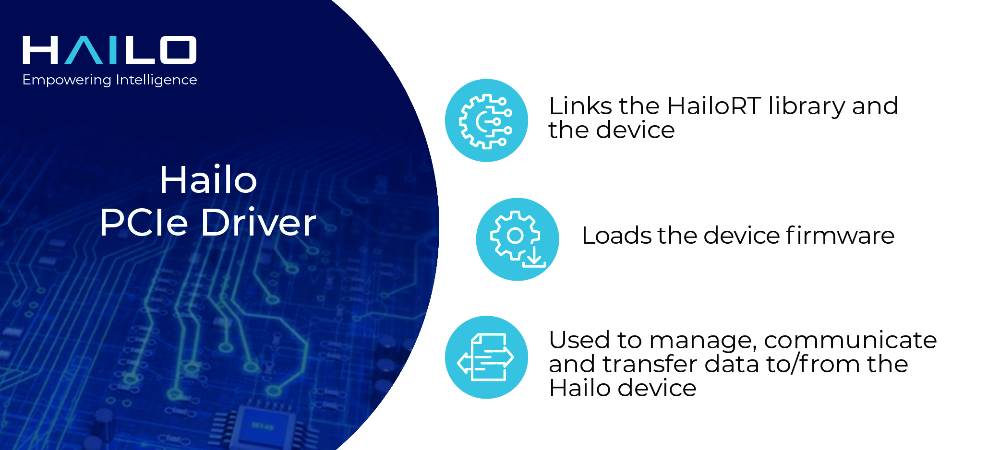

  

# Hailo PCIe driver #

Hailo's PCIe driver is required when working with a Hailo device via the PCIe interface. It links the [**HailoRT library**](https://github.com/hailo-ai/hailort)
and the device, and loads the device's firmware when working through this interface. The device driver
is used to manage the Hailo device, communicate with the device and transfer data to/from the device.

## Usage and Compilation

See [**hailo.ai developer zone documentation**](https://hailo.ai/developer-zone/documentation/hailort/latest/?sp_referrer=drivers/pcie_linux.html) (registration is required for  full documentation access).

## Changelog

See [**hailo.ai developer zone - HailoRT changelog**](https://hailo.ai/developer-zone/documentation/hailort/latest/?sp_referrer=changelog/changelog.html) (registration required).

## License

Distributed under the [**GNU General Public License version 2 license**](https://www.gnu.org/licenses/old-licenses/gpl-2.0.en.html)

## Contact

Contact information and support is available at [**hailo.ai**](https://hailo.ai/contact-us/).

## About Hailo-8™

Hailo-8 is a deep learning processor for edge devices. The Hailo-8 provides groundbraking efficiency for neural network deployment.
The Hailo-8 edge AI processor, featuring up to 26 tera-operations per second (TOPS), significantly outperforms all other edge processors.
Hailo-8 is available in various form-factors, including the Hailo-8 M.2 Module.

The Hailo-8 AI processor is designed to fit into a multitude of smart machines and devices, for a wide variety of sectors including Automotive, Smart Cities, Industry 4.0,
Retail and Smart Homes.

For more information, please visit [**hailo.ai**](https://hailo.ai/).
