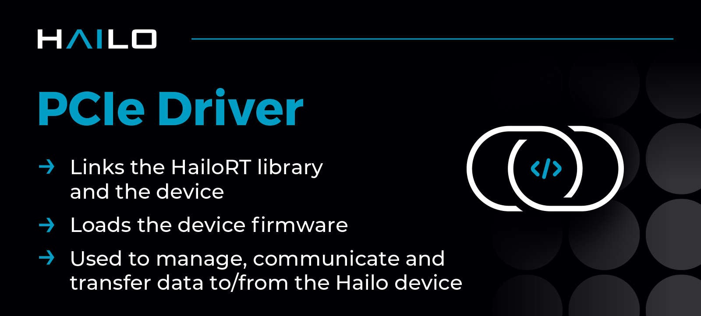

  

# Hailo PCIe driver #

The Hailo PCIe driver is necessary for interacting with a Hailo device over the PCIe interface. It connects the [**HailoRT library**](https://github.com/hailo-ai/hailort) to the device and loads the
device's firmware when using this interface. The driver is responsible for managing the Hailo device, communicating with it, and transferring data to and from the device.

## Usage and Compilation

See [**hailo.ai developer zone documentation**](https://hailo.ai/developer-zone/documentation/hailort/latest/?sp_referrer=drivers/pcie_linux.html) (registration is required for  full documentation access).

## Changelog

See [**hailo.ai developer zone - HailoRT changelog**](https://hailo.ai/developer-zone/documentation/hailort/latest/?sp_referrer=changelog/changelog.html) (registration required).

## License

Distributed under the [**GNU General Public License version 2 license**](https://www.gnu.org/licenses/old-licenses/gpl-2.0.en.html)

## Support

If you need support, please post your question on our [**Hailo community Forum**](https://community.hailo.ai/) for assistance.

Contact information is available at [**hailo.ai**](https://hailo.ai/contact-us/).

## About Hailo

Hailo offers breakthrough AI Inference Accelerators and AI Vision Processors uniquely designed to accelerate embedded deep learning applications on edge devices.

The Hailo AI Inference Accelerators allow edge devices to run deep learning applications at full scale more efficiently, effectively, and sustainably, with an architecture that takes advantage of the core properties of neural networks.

The Hailo AI Vision Processors (SoC) combine Hailo's patented and field proven AI inferencing capabilities with advanced computer vision engines, generating premium image quality and advanced video analytics.

For more information, please visit [**hailo.ai**](https://hailo.ai/).
